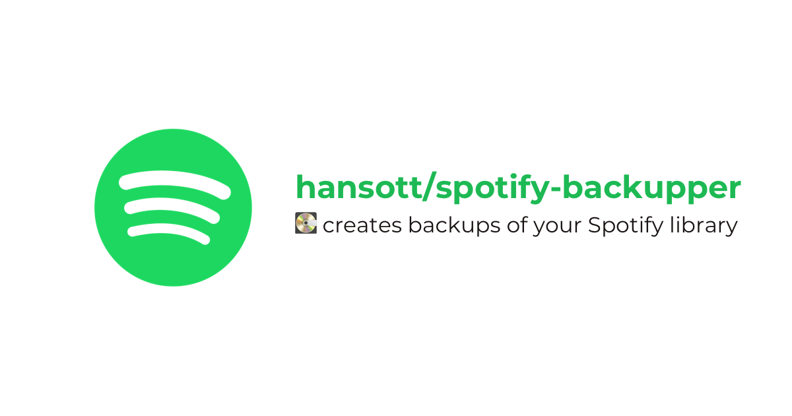

# 

[![Latest Version on Packagist][ico-version]][link-packagist]
[![Software License][ico-license]](LICENSE.md)
[![Total Downloads][ico-downloads]][link-downloads]

If you like this package, feel free to [buy me a coffee](https://www.paypal.me/HansOtt/5) ☕️.

## Install

Via Composer

``` bash
$ composer require hansott/spotify-backupper
```

## Usage

```
$ spotify-backupper --help

--format <argument>
     The format for encoding your Spotify library. (json or xml)


--help
     Show the help page for this command.


--storage <argument>
     The backup storage. (local or dropbox)


--with-collaborative/--with-collab
     Whether to include collaborative playlists.
```

### Create a local backup

```
$ cd my-backup-dir
$ SPOTIFY_ACCESS_TOKEN=yourToken path/to/spotify-backupper
```

If you don't know how to get an access token, just run `$ spotify-backupper` without `SPOTIFY_ACCESS_TOKEN` to see instructions.

### Create a backup on Dropbox

```
$ SPOTIFY_ACCESS_TOKEN=yourToken DROPBOX_ACCESS_TOKEN=yourToken path/to/spotify-backupper --storage dropbox
```

## Change log

Please see [CHANGELOG](CHANGELOG.md) for more information what has changed recently.

## Contributing

Please see [CONTRIBUTING](CONTRIBUTING.md) and [CONDUCT](CONDUCT.md) for details.

## Security

If you discover any security related issues, please email **hans at iott consulting** instead of using the issue tracker.

## Credits

- [Hans Ott][link-author]
- [All Contributors][link-contributors]

## License

The MIT License (MIT). Please see [License File](LICENSE.md) for more information.

[ico-version]: https://img.shields.io/packagist/v/hansott/spotify-backupper.svg?style=flat-square
[ico-license]: https://img.shields.io/badge/license-MIT-brightgreen.svg?style=flat-square
[ico-downloads]: https://img.shields.io/packagist/dt/hansott/spotify-backupper.svg?style=flat-square

[link-packagist]: https://packagist.org/packages/hansott/spotify-backupper
[link-downloads]: https://packagist.org/packages/hansott/spotify-backupper
[link-author]: https://github.com/hansott
[link-contributors]: ../../contributors
